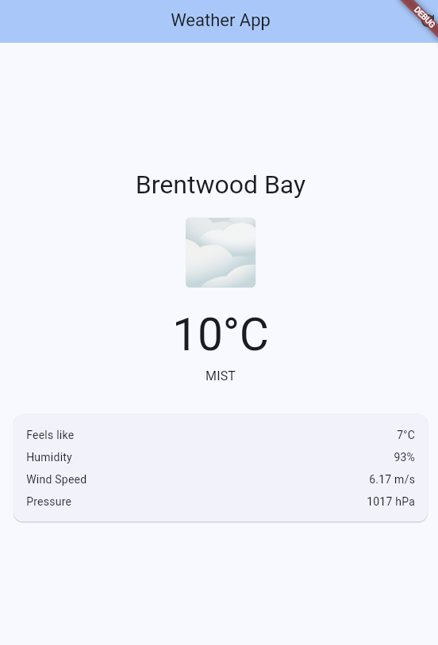

# Brentwood Weather App

This is a simple weather app built with Flutter for demo purposes.

## Screenshot

## Getting Started

To run this app:

1. Ensure you have [Flutter](https://flutter.dev) installed.
2. Run `flutter pub get` to fetch dependencies.
3. Run `flutter run` to launch the app on your device or emulator.

---

For more information on Flutter, see the [official documentation](https://docs.flutter.dev/).
